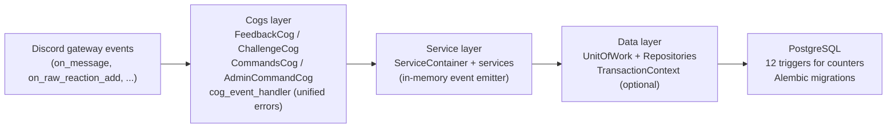

# Bottekin Project

## Quick links

## 1) Preview

<aside>
📌

**Project:** BotTekin (Discord bot for “i listen to your music”)

**Core systems:** Feedback, Challenges, Leaderboards, Stats, Roles, Sync engine, Quote image generation

**Stack:** Python service (Docker Swarm) + Postgresql + Github Actions CI/CD + Grafana/Loki/Prometheus

</aside>

## 2) Project overview

BotTekin is a Discord bot i built specifically for “i listen to your music” community server. Members share tracks for feedback, participate in official and community hosted challenges, vote on submissions, and earn roles based on how many feedback they’ve given and how many challenges they participated in. The bot automates all of this, tracking stats (feedback, shared music, and challenge stats), managing challenge lifecycles, updating live leaderboards, generating quote images, and syncing all data from Discord's history on startup.

It runs as a containerised python service deployed on docker swarm with automated CI/CD via github actions, a postgresql backend, and a observability stack using grafana, loki, and prometheus.

## 3) Features

- Feedback System
    
    Members share tracks in designated channels bot checks if the track is shared in a “attachment channel” or a “link channel” and extracts track title and platform with a dedicated Extractor system.
    
    - supported platforms and audio files:
        - Spotify
        - Soundcloud
        - Youtube
        - Apple music
        - .wav files
        - .mp3 files
        
    
    Others post feedback in the thread created from the shared track. The bot validates feedback (gibberish detection, duplicate check, word count, duplicate content, self-feedback), records it, and tracks per user stats. Triggers increment counters on the database level via postgresql triggers.
    
- Challenge System
    
    Full challenge lifecycle management. Syncs challenge data in designated “challenge-info” channel from a Dyno bot embed, accepts and validates submissions, manages voting (one vote per user, self vote prevention), declares winners via trophy reaction(only admin users can declare winners by adding a trophy reaction), and updates the live leaderboards in real time.
    
    Extracts the challenge duration from the designated embed and starts scheduled jobs to end challenge&voting 
    
- Leaderboards
    
    Six  leaderboard types: feedback, challenge live, all-time winners, submissions, server activity (daily/weekly/monthly), and most active time periods. Each updates automatically on relevant events and persists message ids via storing ids in the database to edit in place rather than repost.
    
- Stats command
    
    A /bottekin stats slash command that generates three rich embeds per user: music stats (top tracks, most reacted track, top feedback givers), feedback stats (total words, members supported), and challenge stats (submissions, wins, most voted member).
    
- Role assignment
    
    Automatically assigns tiered discord roles based on total feedback given (15, 30, 50, 100, 1000 thresholds) and total challenge submissions (3, 10, 30, 50, 100). Removes outdated roles and adds correct ones on every sync. Any relevant event (new feedback post, new submission post or delete event) triggers role sync to check if new role asssignment is required. 
    
- Data sync engine
    
    On every startup, the bot replays all discord channel history to rebuild a consistent database state, users, tracks, feedback, challenge submissions, votes, and winners. Handles pagination, deduplication, stale data cleanup, and partial failures.
    
- Track notification system
    
    Tracks that have less than 3 feedback messages get posted to a dedicated channel so the community can find them. Updates the message as feedback comes in, and removes it once the threshold is reached or if the track is older than 14 days. Also handles "user left server" notifications on track threads and if the user comes back to the server, the bot cleans up “user left server” messages from related threads.
    
- Make it quote
    
    A context menu command that can be used by right clicking on any message>Apps>BotTekin>make_it_quote. This command turns any discord message to a  quote image using pillow, (python image processing library). This command includes rate limiting (5 uses/day per user via apscheduler), a delete button for the original author, and a visual card layout with avatar overlay.
    
    Only the original author or the caller user can use the delete button.
    
- Infrastructure
    - Health check and metrics
        
        Fastapi server exposes /health (DB connectivity check) and /metrics (Prometheus). Tracked: command totals, health check counts, DB connection status, bot uptime.
        
    - Observability
        
        Grafana alloy collects structured json logs from loguru and ships them to Grafana Cloud Loki. Node Exporter and postgres-exporter send metrics to Grafana Cloud Prometheus. Full log parsing with stage labels.
        
    - Automated backups
        
        Dedicated backup container runs pg_dump on a cron schedule (daily/weekly/monthly) with configurable retention. Creates checksums and metadata for each backup. Includes a restore script with safety backup and rollback.
        
    - CI/CD
        
        GitHub actions builds and pushes two docker images (bot + backup), takes a pre-deployment database backup, deploys to docker swarm via ssh with envsubst, then verifies the service is running before completing with a max attempt limit: 30.
        
    

## 4) Architecture

### Layers (drill-down)

- Discord layer (Cogs + Commands)
    - **Event handling:** FeedbackCog, ChallengeCog handle gateway events (on_message, on_raw_reaction_add, etc.)
    - **Commands:** CommandsCog + AdminCommandCog expose slash commands
    - **Error handling:** all event handlers are wrapped in **cog_event_handler** for unified error handling
- Service layer (ServiceContainer + 9 services)
    - FeedbackService
    - ChallengeService
    - TrackService
    - UserService
    - LeaderboardService
    - StatsService
    - RoleService
    - SyncService
    - MakeItQuoteService
    - **Pattern:** all extend BaseService
    - **Communication:** services publish/subscribe via an in memory event emitter (avoids direct coupling)
- Data layer (UnitOfWork + Repositories)
    - **UnitOfWork:** single entry point with 5 repositories (users, tracks, feedback, challenges, leaderboards)
    - **Transactions:** supports standalone sessions and shared transactions via TransactionContext
    - **Consistency:** BaseRepository provides consistent error handling and session management
- Database (Postgresql triggers)
    - **Counters:** total_feedbacks, total_votes, total_submissions, total_challenges_won, etc.
    - **Guarantee:** increments handled by **12 Postgresql triggers**, not application code
    - **Migrations:** Alembic

## 5)Testing

A total of **344** tests are written for the project.

- **127** unit tests
- **217** integration test.

### Integration

- **Repository layer**
    
    Every repository method is tested against a real postgresql instance via testcontainers. covers bulk inserts, upserts, cascades, cleanup with date filters, triggers firing correctly. Full CRUD on all 5 repositories.
    
- **Service layer**
    
    FeedbackService, ChallengeService, TrackService, UserService, LeaderboardService, RoleService all tested with real db. Tests verify triggers fire, counters update correctly, cascades work, and events propagate.
    
- **Sync services**
    
    TrackSync, FeedbackSync, ChallengeSync, UserSync all tested end to end with mocked Discord channels and real DB. Covers pagination, partial cleanup, stale data, non-existent authors, duplicate handling.
    
- **Validators (unit + integration)**
    
    MessageDetector tested for gibberish threshold (70%), duplicate words. FeedbackValidator tested with real DB: gibberish, duplicated words, already given feedback, duplicate content, DB short circuit ordering.
    

### Unit

- **Discord cogs**
    
    FeedbackCog and ChallengeCog are tested covering every event handler. Uses discord.py mock factories (make_member, make_message, make_thread, make_reaction) Tests every branch: wrong channel, bot author, duplicate reaction, etc.
    
- **Embed builders**
    
    Every embed builder method is tested against its output dict. Tests verify field names, values, description content, and partial data cases (missing optional parameters like top feedback givers etc..). Stats embeds and leaderboard embeds all covered.
    

## 6)Requirements&Permissions

### Required Permissions

- Manage Roles
- View Channels
- Send messages
- Create public threads
- Send messages in threads
- Manage messages
- Manage threads
- Attach files
- Read Message history
- Add reactions
- Bypass Slowmode

### Bot command permissions setup

By default, BotTekin doesn’t let users call commands outside of the “commands” channel. And if a command called outside of the commands channel, the bot sends an ephemeral message to the user with a link to “commands” channel.

But additionally, on Server settings>integrations>BotTekin>Command Permissions 

under “Channels” section you should **disable** “All-channels” and add “commands” channel.

This way, when users are in a unrelated channel the BotTekin commands will be invisible and only visible if the users are in “commands” channel.

“Make it quote” command also needs additional permission configuration.

On Server settings>integrations>BotTekin>Commands section, select “make_it_quote” and add “channel overrides” this way “make_it_quote” command will be visible&usable for only the channels you selected. 

End result should look like this:

### Requirements

- Dedicated channel for Alerts. (Error logs)
- Webhook to send alert messages to the dedicated alert channel
- Dedicated commands channel
- Dedicated channel to share jump urls of tracks has less than 3 feedback
- Dedicated leaderboard channel to share all the leaderboards